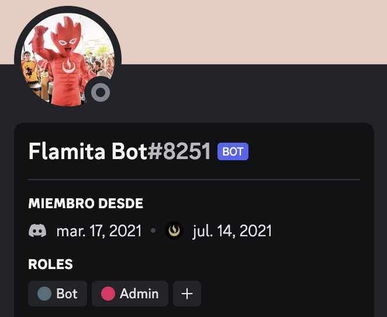
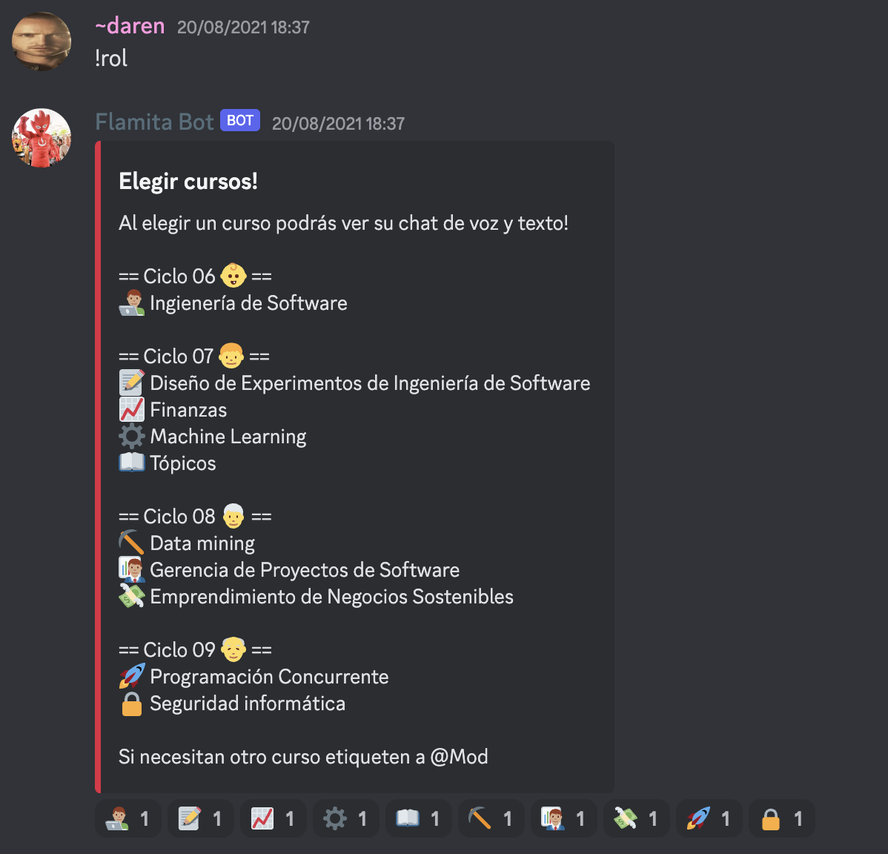
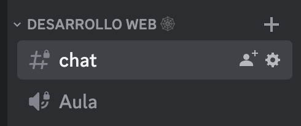

# Flamita Bot 🔥

Discord Bot in charge of assigning roles so that students can access their courses.
(Flamita was hosted on a Heroku free deno but with the service killing free hosting options now is in search of a new home :()

<p align="center">
  
</p>

## Run

```sh
npm install
node bot.js
```

## Develop

```sh
npm install
nodemon bot.js
```

## Commands

| Command                 | Action                                                                           |
| ----------------------- | -------------------------------------------------------------------------------- |
| !link                   | Get the link to invite others students to the server                             |
| !exigete                | Finish the university motto                                                      |
| !ping                   | Test conection, recieves pong if connected                                       |
| !play {music_name}      | Search in youtube and plays the music on the voice channel                       |
| !mimir                  | Bot goes to sleep and disconects from the voice channel                          |
| !rol                    | Sends list of all the available courses andthe user selects wich course to enter |
| 'good bot' or 'gud bot' | He'll react with a ❤️ reaction :)                                                |

## How to enter to a course area

1. Call `!rol` and you'll see all the courses.

   

2. Select which course you want by reacting with their assigned emoji.

3. The bot will assign you the role of the course and you are in! 🥳

   
